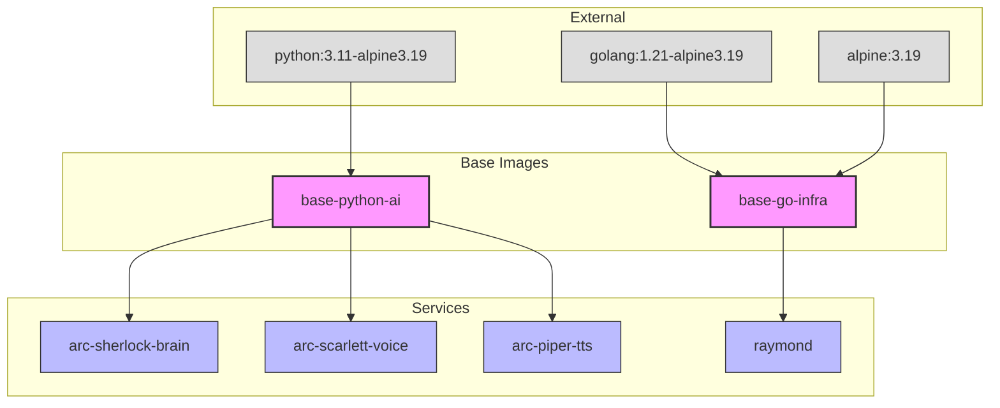

# Docker Image Hierarchy

**Task:** T036
**Last Updated:** January 2026

This document describes the Docker image dependency hierarchy for the A.R.C. platform.

---

## Overview

A.R.C. uses a layered image strategy to optimize build times and ensure consistent security updates:

```
┌─────────────────────────────────────────────────────────────────┐
│                     External Base Images                         │
│  python:3.11-alpine3.19    golang:1.21-alpine3.19    alpine:3.19 │
└─────────────────────────────────────────────────────────────────┘
                              │
                              ▼
┌─────────────────────────────────────────────────────────────────┐
│                      A.R.C. Base Images                          │
│     ghcr.io/arc/base-python-ai    ghcr.io/arc/base-go-infra     │
└─────────────────────────────────────────────────────────────────┘
                              │
                              ▼
┌─────────────────────────────────────────────────────────────────┐
│                      A.R.C. Services                             │
│  arc-sherlock-brain  arc-scarlett-voice  arc-piper-tts  raymond │
└─────────────────────────────────────────────────────────────────┘
```

---

## Base Images

### Python AI Base (`ghcr.io/arc/base-python-ai`)

**Purpose:** Base image for all Python AI/ML services

**Source:** `.docker/base/python-ai/Dockerfile`

**Includes:**
- Python 3.11 on Alpine 3.19
- PostgreSQL client libraries (libpq)
- Common ML dependencies (numpy, scipy via system packages)
- OpenTelemetry SDK
- Non-root user (`arcuser`, UID 1000)

**Dependent Services:**
| Service | Directory |
|---------|-----------|
| arc-sherlock-brain | `services/arc-sherlock-brain/` |
| arc-scarlett-voice | `services/arc-scarlett-voice/` |
| arc-piper-tts | `services/arc-piper-tts/` |

**Size Target:** <300MB

### Go Infrastructure Base (`ghcr.io/arc/base-go-infra`)

**Purpose:** Base image for Go infrastructure services

**Source:** `.docker/base/go-infra/Dockerfile` (future)

**Includes:**
- Go 1.21 build environment
- Alpine 3.19 runtime
- CA certificates
- Non-root user (`arcuser`, UID 1000)

**Dependent Services:**
| Service | Directory |
|---------|-----------|
| raymond | `services/utilities/raymond/` |

**Size Target:** <50MB (final runtime image)

---

## Dependency Graph



---

## Build Order

When making changes, follow this build order:

### 1. Base Image Changes

If you change `.docker/base/*`:

```bash
# 1. Build base images first
make build-base-images

# 2. Then rebuild all dependent services
make build-services
```

**Impact:** All services using that base image must be rebuilt.

### 2. Service Code Changes

If you change `services/arc-*/src/*`:

```bash
# Only rebuild the affected service
docker build -t arc-sherlock-brain:local services/arc-sherlock-brain/
```

**Impact:** Only the changed service needs rebuilding.

### 3. Library Changes

If you change `libs/python-sdk/*`:

```bash
# Rebuild all Python services
make build-services
```

**Impact:** All services using the library must be rebuilt.

### 4. Compose Configuration Changes

If you change `deployments/docker/*`:

```bash
# No rebuild needed, just restart
docker compose -f deployments/docker/docker-compose.yml up -d
```

**Impact:** No image rebuild, just container restart.

---

## Impact Analysis

Use the build impact script to determine what needs rebuilding:

```bash
# Analyze a specific file
./scripts/validate/check-build-impact.sh .docker/base/python-ai/Dockerfile

# Analyze git changes
./scripts/validate/check-build-impact.sh

# Analyze a directory
./scripts/validate/check-build-impact.sh services/arc-sherlock-brain/
```

### Example Output

```
Analyzing: .docker/base/python-ai/Dockerfile

  → Base image change - affects all dependent services
    → arc-sherlock-brain
    → arc-scarlett-voice
    → arc-piper-tts

Build Impact Summary
Services that need rebuilding:
  • arc-sherlock-brain
  • arc-scarlett-voice
  • arc-piper-tts

Total: 3 service(s)
```

---

## Caching Strategy

### Layer Ordering

Dockerfiles are optimized for cache efficiency:

1. **Base image** - Rarely changes
2. **System packages** - Monthly updates
3. **Python/Go dependencies** - Weekly changes
4. **Application code** - Daily changes

### Cache Mounts

Build commands use cache mounts for package managers:

```dockerfile
# Python
RUN --mount=type=cache,target=/root/.cache/pip \
    pip install -r requirements.txt

# Go
RUN --mount=type=cache,target=/go/pkg/mod \
    go mod download
```

### Warm vs Cold Builds

| Build Type | Time | When |
|------------|------|------|
| Cold (no cache) | 3-5 min | First build, base image change |
| Warm (deps cached) | 30-60s | Dependency change |
| Hot (code only) | 10-30s | Source code change |

---

## Version Pinning

All images use explicit version pins:

| Layer | Pin Strategy | Example |
|-------|-------------|---------|
| Alpine | Minor version | `alpine:3.19` |
| Python | Minor version | `python:3.11-alpine3.19` |
| Go | Minor version | `golang:1.21-alpine3.19` |
| System packages | Alpine version | (pinned via Alpine version) |
| Python packages | requirements.txt | `fastapi==0.109.0` |
| Go modules | go.mod | `require github.com/nats-io/nats.go v1.31.0` |

---

## Updating Base Images

### Monthly Update Process

1. **Check for updates:**
   ```bash
   # Check Alpine security advisories
   # Check Python releases
   # Check Go releases
   ```

2. **Update base image Dockerfiles:**
   ```bash
   # Edit .docker/base/*/Dockerfile
   # Update FROM tags if needed
   ```

3. **Rebuild and test:**
   ```bash
   make build-base-images
   make test
   ```

4. **Run security scan:**
   ```bash
   ./scripts/validate/check-security.sh
   ```

5. **Push to registry:**
   ```bash
   make push-base-images
   ```

6. **Update services:**
   ```bash
   make build-services
   make push-services
   ```

---

## Related Documentation

- [Docker Standards](../standards/DOCKER-STANDARDS.md) - Dockerfile requirements
- [Security Scanning](../guides/SECURITY-SCANNING.md) - Vulnerability scanning
- [Image Tagging](../guides/IMAGE-TAGGING.md) - Version tagging strategy
- [GHCR Publishing](../guides/GHCR-PUBLISHING.md) - Publishing to registry
