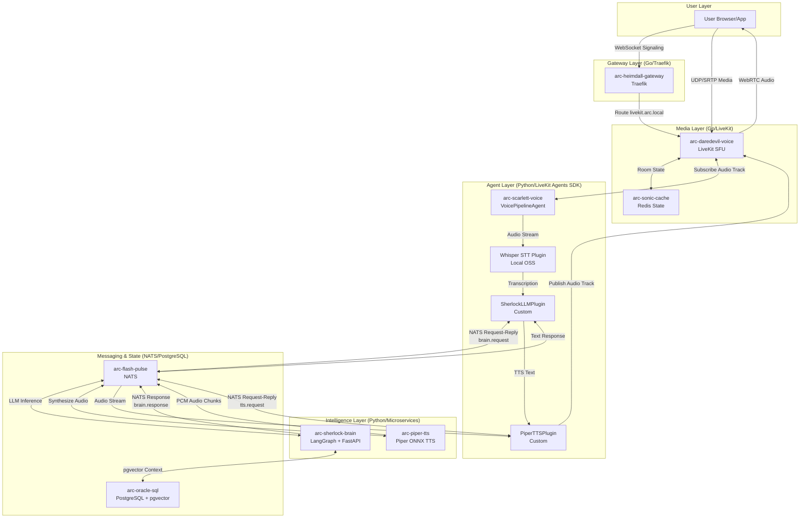
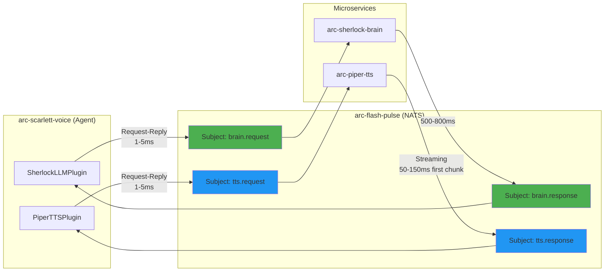
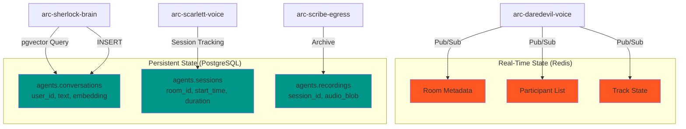

# ADR-001: The A.R.C. Daredevil Real-Time Stack

**The Central Nervous System for Agentic Intelligence**

**Status:** ✅ APPROVED / FINAL  
**Date:** 2025-12-13  
**Author:** A.R.C. Architect  
**Layer:** Core Infrastructure + Agent Services

---

## 1. Executive Summary: Open-Source, Hybrid, Optimized

A.R.C. is a **voice-first platform** built on 100% **open-source components**. A slow platform is a failed platform. The old world of text-based, HTTP request/response is dead. Our agents must process and reply in **sub-500ms** to achieve human-like conversation (the "Her" interface).

The **Daredevil Stack** is the dedicated, high-performance media layer built on **LiveKit** with a **hybrid architecture**:

- **LiveKit Agents SDK** handles voice pipeline orchestration (STT/LLM/TTS plugins)
- **Microservices** provide custom reasoning (`arc-sherlock-brain`) and TTS (`arc-piper-tts`)
- **Go-based core** handles WebRTC plumbing, Python/LangGraph handles intelligence

**Architecture Philosophy**: Phase 3D (Hybrid) → Phase 4 (Optimized <500ms)

> **MANDATE:** No cloud dependencies. All STT/LLM/TTS components must be open-source and self-hostable.

---

## 2. Context & Problem Statement

### The Problem

Traditional HTTP-based voice interfaces are dead on arrival:

- **Latency:** Round-trip time for HTTP request/response adds 100-300ms minimum
- **Scalability:** Opening a new HTTP connection per audio chunk is insane
- **Reliability:** TCP/HTTP is terrible for real-time media (packet loss = stalls)
- **User Experience:** Humans expect <200ms response time for natural conversation

### The Requirement

We need:

1. **WebRTC transport** for low-latency, UDP-based media streaming
2. **Selective Forwarding Unit (SFU)** architecture for efficient multi-party routing
3. **Go-based control plane** for high-performance signaling and state management
4. **Python-based agent workers** that can focus on AI logic, not transport

---

## 3. Decision

We adopt **LiveKit** as the core real-time media server and build the **Daredevil Stack** with the following components:

| Component            | A.R.C. Codename        | Technology                      | Role                                               |
| -------------------- | ---------------------- | ------------------------------- | -------------------------------------------------- |
| **Media Server**     | `arc-daredevil-voice`  | Go (LiveKit Server)             | SFU for WebRTC media routing, uses Redis for state |
| **Agent Worker**     | `arc-scarlett-voice`   | Python (LiveKit Agents SDK)     | Voice pipeline orchestrator using custom plugins   |
| **Brain Service**    | `arc-sherlock-brain`   | Python (LangGraph + PostgreSQL) | Reasoning engine with pgvector memory              |
| **TTS Service**      | `arc-piper-tts`        | Python (Piper ONNX)             | Neural TTS with NATS streaming                     |
| **STT Engine**       | Built-in to Scarlett   | Whisper.cpp or faster-whisper   | Local speech-to-text (open-source)                 |
| **Archival Service** | `arc-scribe-egress`    | LiveKit Egress Sidecar          | Records sessions to PostgreSQL/pgvector            |
| **Ingress Service**  | `arc-sentry-ingress`   | LiveKit Ingress Sidecar         | Converts RTMP/SIP to LiveKit rooms                 |
| **Cache**            | `arc-sonic-cache`      | Redis                           | Required for Daredevil's room/participant state    |
| **Messaging**        | `arc-flash-pulse`      | NATS                            | Low-latency request-reply for brain/TTS calls      |
| **Persistence**      | `arc-oracle-sql`       | PostgreSQL + pgvector           | Conversation history and context retrieval         |
| **Gateway**          | `arc-heimdall-gateway` | Traefik                         | Routes WebSocket signaling to Daredevil            |

---

## 4. Architecture Flow (Hybrid Phase 3D → Optimized Phase 4)

This enforces our **Polyglot Hybrid Architecture**: Go for transport/control, Python for intelligence, microservices for reasoning/TTS.

### 4.1 High-Level Architecture (Phase 3D)



### 4.2 Detailed Data Flow (User Speaks → Agent Responds)

```mermaid
sequenceDiagram
    participant User
    participant LiveKit as arc-daredevil-voice<br/>(LiveKit SFU)
    participant Agent as arc-scarlett-voice<br/>(Agents SDK)
    participant STT as Whisper STT<br/>(Local Plugin)
    participant NATS as arc-flash-pulse<br/>(NATS)
    participant Brain as arc-sherlock-brain<br/>(LangGraph)
    participant DB as arc-oracle-sql<br/>(pgvector)
    participant TTS as arc-piper-tts<br/>(Piper ONNX)

    Note over User,TTS: Phase 3D: Hybrid Architecture (Open-Source)

    User->>LiveKit: WebRTC Audio Stream (UDP)
    LiveKit->>Agent: Forward Audio Track
    Agent->>STT: Audio Chunks
    STT-->>Agent: "What's the weather?" (200-400ms)

    Note over Agent,Brain: Custom LLM Plugin (SherlockLLMPlugin)
    Agent->>NATS: Publish brain.request<br/>{text, user_id}
    NATS->>Brain: Request-Reply (1-5ms)

    Brain->>DB: SELECT embeddings<br/>WHERE user_id=X<br/>ORDER BY similarity LIMIT 5
    DB-->>Brain: Context (top 5 conversations)
    Brain->>Brain: LangGraph State Machine<br/>retrieve_context → generate_response
    Note over Brain: Uses local LLM<br/>(Llama, Mistral, etc.)
    Brain->>DB: INSERT conversation<br/>(text, embedding, timestamp)
    Brain->>NATS: Publish brain.response<br/>"Sunny, 72°F" (500-800ms)
    NATS-->>Agent: Response Text

    Note over Agent,TTS: Custom TTS Plugin (PiperTTSPlugin)
    Agent->>NATS: Publish tts.request<br/>{text: "Sunny, 72°F"}
    NATS->>TTS: Request-Reply (1-5ms)

    TTS->>TTS: Piper ONNX Synthesis<br/>22kHz PCM chunks (50-150ms)
    TTS->>NATS: Stream PCM Chunks<br/>(not buffered!)
    NATS-->>Agent: Audio Chunks
    Agent->>LiveKit: Publish Audio Track
    LiveKit->>User: WebRTC Audio Stream (UDP)

    Note over User: Total Latency: 900-1800ms (Phase 3D)<br/>Target: <500ms (Phase 4)
```



### 4.3 NATS Messaging Patterns (Low-Latency Communication)



### 4.4 Flow Breakdown (Phase 3D Hybrid)

1. **User Connects (WebRTC Setup):** Browser establishes WebSocket connection to `wss://livekit.arc.local` → Traefik routes to `arc-daredevil-voice` → ICE/DTLS negotiation → UDP media channels established

   - **Latency:** 20-50ms

2. **Audio Ingress (User Speaks):** User audio → WebRTC (Opus codec) → LiveKit SFU → `arc-scarlett-voice` subscribes to audio track

   - **Latency:** 10-30ms

3. **Speech-to-Text (Whisper):** Audio chunks → Whisper STT plugin (local inference) → Transcription

   - **Latency:** 200-400ms (depends on model size: tiny/base/small)

4. **Brain Processing (LangGraph + NATS):**

   - Agent → NATS `brain.request` (1-5ms)
   - `arc-sherlock-brain` receives request
   - Retrieves context from `arc-oracle-sql` pgvector (20-50ms)
   - LangGraph state machine: `retrieve_context` → `generate_response` (400-1200ms with local LLM)
   - Persists conversation to PostgreSQL (10-30ms)
   - Returns response via NATS `brain.response` (1-5ms)
   - **Latency:** 500-800ms total

5. **Text-to-Speech (Piper + NATS):**

   - Agent → NATS `tts.request` (1-5ms)
   - `arc-piper-tts` receives request
   - Piper ONNX synthesis (22kHz PCM) → Stream chunks via NATS (not buffered!)
   - First audio chunk ready in 50-100ms
   - **Latency:** 100-300ms for complete synthesis

6. **Audio Egress (Agent Responds):** Agent publishes audio track → LiveKit SFU → WebRTC → User hears response
   - **Latency:** 10-30ms

**Total End-to-End Latency (Phase 3D):** 900-1800ms  
**Target (Phase 4 Optimized):** <500ms P95, <200ms TTFT (Time To First Token)

### 4.5 State Management (Redis + PostgreSQL)



---

## 5. Technical Specifications

### 5.1 Port Mappings (Critical for WebRTC)

| Service               | Protocol | Host Port   | Container Port | Purpose                        |
| --------------------- | -------- | ----------- | -------------- | ------------------------------ |
| `arc-daredevil-voice` | TCP      | 7880        | 7880           | HTTP API & WebSocket signaling |
| `arc-daredevil-voice` | UDP      | 50000-60000 | 50000-60000    | WebRTC media (RTP/RTCP)        |
| `arc-sonic-cache`     | TCP      | 6379        | 6379           | Redis state sync               |

### 5.2 Environment Variables

```bash
# Daredevil (LiveKit Server)
LIVEKIT_KEYS="api_key:secret_key"
REDIS_URL="redis://arc-sonic-cache:6379"
LIVEKIT_CONFIG="/etc/livekit.yaml"

# Scarlett (Agent Worker - Hybrid Phase 3D)
LIVEKIT_URL="ws://arc-daredevil-voice:7880"
LIVEKIT_API_KEY="api_key"
LIVEKIT_API_SECRET="secret_key"
NATS_URL="nats://arc-flash-pulse:4222"
WHISPER_MODEL="base"  # Options: tiny, base, small, medium (base = 200-400ms)
USE_FASTER_WHISPER="true"  # faster-whisper for GPU acceleration

# Sherlock Brain (LangGraph Service)
NATS_URL="nats://arc-flash-pulse:4222"
POSTGRES_URL="postgresql://arc-oracle-sql:5432/arc"
LLM_MODEL="mistral:7b-instruct"  # Local Ollama or vLLM endpoint
LLM_ENDPOINT="http://localhost:11434"  # Ollama default
EMBEDDING_MODEL="all-MiniLM-L6-v2"  # sentence-transformers

# Piper TTS (Neural TTS Service)
NATS_URL="nats://arc-flash-pulse:4222"
PIPER_MODEL="en_US-lessac-medium.onnx"
PIPER_SAMPLE_RATE="22050"  # Piper native output
TTS_SAMPLE_RATE_CONVERSION="false"  # Set to "scipy" if LiveKit needs 16kHz
```

### 5.3 LiveKit Server Configuration (`livekit.yaml`)

```yaml
port: 7880
rtc:
  port_range_start: 50000
  port_range_end: 60000
  use_external_ip: true # Critical for local dev
  tcp_port: 7881

redis:
  address: arc-sonic-cache:6379

keys:
  api_key: ${LIVEKIT_API_KEY}
  secret_key: ${LIVEKIT_API_SECRET}

logging:
  level: info

room:
  auto_create: true
  empty_timeout: 300 # 5 minutes
  max_participants: 10
```

---

## 6. Performance Requirements

### Phase 3D (Hybrid - Open Source)

| Metric                 | Target      | Measurement                                |
| ---------------------- | ----------- | ------------------------------------------ |
| **End-to-End Latency** | <1000ms P95 | User speech → Agent response (full cycle)  |
| **TTFT**               | <500ms      | Time To First Token (first audio playback) |
| **WebRTC Jitter**      | <30ms       | UDP packet variance                        |
| **Packet Loss**        | <1%         | RTP stream quality                         |
| **Room Join Time**     | <500ms      | WebSocket connect → ICE complete           |
| **STT Latency**        | <400ms      | Whisper inference (base model)             |
| **LLM Latency**        | <800ms      | LangGraph + local LLM (Mistral 7B)         |
| **TTS Latency**        | <300ms      | Piper synthesis (first chunk <100ms)       |
| **NATS Overhead**      | <5ms        | Request-reply round trip                   |

### Phase 4 (Optimized - Streaming)

| Metric                 | Target     | Measurement                                  |
| ---------------------- | ---------- | -------------------------------------------- |
| **End-to-End Latency** | <500ms P95 | User speech → Agent response (streaming)     |
| **TTFT**               | <200ms     | Time To First Token (streaming pipeline)     |
| **Streaming LLM**      | <200ms     | First sentence chunk from LangGraph          |
| **Streaming TTS**      | <100ms     | First PCM audio chunk from Piper             |
| **Smart Chunking**     | 15 words   | Max words per TTS chunk (sentence splitting) |
| **Parallel Pipeline**  | 50% faster | LLM→TTS overlap (multi-sentence responses)   |

---

## 7. Consequences

### Positive

✅ **100% Open-Source** - No cloud dependencies, fully self-hostable  
✅ **Hybrid Architecture** - Best of both worlds (LiveKit SDK + microservices)  
✅ **Sub-500ms latency** achievable with Phase 4 optimizations (streaming + parallel pipeline)  
✅ **Scalable architecture** - SFU scales to hundreds of concurrent rooms  
✅ **Polyglot separation** - Go handles transport, Python handles intelligence  
✅ **Standards-based** - WebRTC is universally supported in browsers  
✅ **Swappable components** - Custom plugins allow brain/TTS replacement  
✅ **Cost-effective** - No per-minute API costs for STT/LLM/TTS  
✅ **Privacy-first** - All audio/conversation data stays local

### Negative

⚠️ **Complexity** - WebRTC debugging (ICE, STUN, TURN) + microservices coordination  
⚠️ **Resource requirements** - Local LLM inference needs GPU (4-8GB VRAM for Mistral 7B)  
⚠️ **Network requirements** - UDP ports must be open (50000-60000)  
⚠️ **Local dev challenges** - Requires proper DNS/host configuration for `livekit.arc.local`  
⚠️ **Initial latency** - Phase 3D baseline (900-1800ms) requires Phase 4 optimizations to reach <500ms  
⚠️ **STT accuracy trade-off** - Smaller Whisper models (base) are faster but less accurate than large-v3

### Risks & Mitigations

| Risk                                | Mitigation                                                                       |
| ----------------------------------- | -------------------------------------------------------------------------------- |
| **NAT traversal fails**             | Deploy TURN server (Coturn) for relay fallback                                   |
| **Redis single point of failure**   | Use Redis Sentinel for HA in production                                          |
| **Agent worker crashes**            | Implement supervisor pattern with health checks                                  |
| **TTS latency spikes**              | Pre-warm Piper models, stream PCM chunks (T055)                                  |
| **LLM inference slow**              | Use quantized models (GGUF Q4), GPU acceleration, sentence streaming (T069-T072) |
| **NATS message loss**               | Enable JetStream persistence for critical messages                               |
| **Sample rate conversion overhead** | Configure LiveKit for 22kHz or use scipy (T057)                                  |
| **Buffered audio delays**           | Stream PCM chunks via NATS, not buffered WAV (T055)                              |

---

## 8. Implementation Phases

### Phase 1: Infrastructure Verification ✅ COMPLETE

**Goal:** Validate existing Go infrastructure and prepare for agent integration

- [x] Verify all core services healthy (`make health-all`)
- [x] Test LiveKit WebRTC connection from browser
- [x] Validate PostgreSQL pgvector extension
- [x] Test NATS messaging (publish/subscribe)
- [x] Create LiveKit JWT token generation utility

**Validation:** Infrastructure verified - all services healthy and connectable

### Phase 2: Foundational Services ✅ COMPLETE

**Goal:** Core components that ALL agent services depend on

- [x] Create `agents` schema in PostgreSQL (conversations, sessions tables)
- [x] Define NATS subjects schema (`agent.*`, `brain.*`, `tts.*`)
- [x] Create Python database models (conversation.py)
- [x] Create Python NATS client wrapper
- [x] Create Python OTEL instrumentation helpers

**Validation:** Foundation ready - agent services can now be implemented

### Phase 3D: Hybrid Architecture (Open-Source) 🎯 CURRENT FOCUS

**Goal:** Full hybrid voice agent with local STT/LLM/TTS (no cloud dependencies)

#### Substep 3D-1: Brain Service (arc-sherlock-brain)

- [ ] T037-T048: Create LangGraph service with NATS handler
- [ ] T037: Service directory structure
- [ ] T038: Dockerfile for LangGraph
- [ ] T039: FastAPI server with `/chat` endpoint
- [ ] T040: PostgreSQL connection (SQLAlchemy)
- [ ] T041: LangGraph state machine (retrieve_context → generate_response)
- [ ] T043: NATS handler for `brain.request` subject
- [ ] T044: Conversation persistence to PostgreSQL
- [ ] T045: pgvector context retrieval (top 5 similar conversations)
- [ ] T047: OTEL instrumentation

**Validation:** Brain responds via NATS, conversations persisted, context retrieval working

#### Substep 3D-2: TTS Service (arc-piper-tts)

- [ ] T052-T060: Create Piper TTS service with NATS streaming
- [ ] T052: Service directory structure
- [ ] T053: Dockerfile for Piper ONNX
- [ ] T054: Download Piper model (en_US-lessac-medium.onnx)
- [ ] T055: **CRITICAL** - NATS handler for streaming PCM (not buffered WAV)
- [ ] T056: FastAPI endpoint `/tts/stream` (HTTP fallback)
- [ ] T057: Sample rate handling (prefer LiveKit 22kHz, else scipy)
- [ ] T059: OTEL instrumentation for TTS latency

**Validation:** Piper synthesizes audio via NATS, first chunk <100ms, sample rate optimized

#### Substep 3D-3: Agent Voice Pipeline (arc-scarlett-voice)

- [ ] T029-T036: Create LiveKit Agents SDK service
- [ ] T029: Service directory structure
- [ ] T030: Dockerfile with LiveKit Agents SDK
- [ ] T031: VoicePipelineAgent with plugins:
  - STT: Whisper plugin (faster-whisper, base model)
  - LLM: **SherlockLLMPlugin** (custom, calls arc-sherlock-brain via NATS)
  - TTS: **PiperTTSPlugin** (custom, calls arc-piper-tts via NATS)
  - VAD: Built-in Silero VAD
- [ ] T049-T051: Implement custom LLM plugin (SherlockLLMPlugin)
- [ ] T061-T063: Implement custom TTS plugin (PiperTTSPlugin)
- [ ] T034: OTEL instrumentation

**Validation:** Full voice pipeline working - user speaks, agent responds via local services

#### Substep 3D-4: Integration & Testing

- [ ] T064-T068: End-to-end integration tests
- [ ] T064: Update docker-compose.services.yml dependencies
- [ ] T065: Integration test script (test_voice_agent_full.sh)
- [ ] T066: Create quickstart guide
- [ ] T067: Structured logging (JSON + trace IDs)
- [ ] T068: Document latency breakdown in Jaeger

**Validation:** All services running, latency <1000ms P95, conversations persisted, traces visible

**Phase 3D Deliverable:** Open-source hybrid voice agent (Whisper + local LLM + Piper)

---

### Phase 4: Latency Optimization (<500ms Target) 🚀 NEXT

**Goal:** Reduce end-to-end latency from <1000ms to <500ms through streaming and optimization

#### Streaming Optimizations

- [ ] T069-T072: Streaming LLM (sentence-by-sentence)
- [ ] T073-T075: Smart sentence chunking (max 15 words, split at commas)
- [ ] T076: Model pre-warming (eliminate 2-5s cold start)
- [ ] T076b: **Parallel LLM→TTS pipeline** (asyncio.Queue, overlap processing)
- [ ] T077-T080: Performance optimizations (connection pooling, pgvector HNSW, Redis caching, MessagePack)
- [ ] T081: Profile pipeline with Jaeger (identify bottlenecks)
- [ ] T082: Integration test validates <500ms P95 + <200ms TTFT

**Phase 4 Deliverable:** Production-ready latency (<500ms P95, <200ms TTFT)

---

### Phase 5: Advanced Features 📊

**Goal:** Session recording, multi-participant, conversation management

- [ ] T083-T088: Deploy `arc-scribe-egress` for session recording
- [ ] T089-T093: Deploy `arc-sentry-ingress` for RTMP/SIP ingress
- [ ] T094-T096: Multi-participant support (LiveKit SDK handles this)
- [ ] T097-T100: Conversation summarization, sentiment analysis, export

**Validation:** Recordings work, multi-user conversations, advanced features operational

---

### Phase 6: Observability & Monitoring 🔍

**Goal:** Production-ready monitoring, alerting, and debugging

- [ ] T101-T103: Grafana dashboards (LiveKit, Agent, System)
- [ ] T104-T105: Prometheus alerting rules
- [ ] T106-T108: Jaeger distributed tracing
- [ ] T109-T111: Structured logging (JSON, trace correlation, Loki queries)

**Validation:** Full observability stack operational - metrics, traces, logs, alerts

---

### Phase 7: Chaos Testing & Resilience 🧪

**Goal:** Validate system resilience under failure conditions

- [ ] T115-T118: Docker-based resilience tests (service kill, DB downtime)
- [ ] T119-T121: k6 load testing (concurrent rooms, message throughput)

**Validation:** System survives failures, load tests pass

---

### Phase 8: Documentation & Polish 📚

**Goal:** Production-ready documentation and security hardening

- [ ] T122-T125: API documentation (OpenAPI specs, plugin docs)
- [ ] T126-T131: Deployment + architecture documentation
- [ ] T132-T137: Code quality (linting, type checks, pre-commit hooks)
- [ ] T138-T144: Security hardening (secrets rotation, Trivy scans)

**Validation:** Production-ready - docs complete, code quality high, security hardened

---

## 9. References

- [LiveKit Documentation](https://docs.livekit.io/)
- [LiveKit Agents SDK (Python)](https://github.com/livekit/agents)
- [WebRTC Standards (IETF)](https://www.w3.org/TR/webrtc/)
- [Piper TTS](https://github.com/rhasspy/piper)
- [A.R.C. Polyglot Standards](../../.github/instructions/copilot.instructions.md)

---

## 10. Appendix: Service Interaction Protocol (Phase 3D)

### 10.1 Token Generation (Go SDK)

```go
// libs/go-sdk/livekit/token.go
func CreateRoomToken(roomName, participantName string) (string, error) {
    at := auth.NewAccessToken(apiKey, apiSecret)
    grant := &auth.VideoGrant{
        RoomJoin: true,
        Room:     roomName,
    }
    at.AddGrant(grant).SetIdentity(participantName)
    return at.ToJWT()
}
```

### 10.2 Agent Worker Entry (Hybrid Phase 3D)

```python
# services/arc-scarlett-voice/src/agent.py
from livekit import agents
from livekit.agents import JobContext, VoicePipelineAgent
from livekit.plugins import whisper, silero
from plugins.sherlock_llm import SherlockLLMPlugin
from plugins.piper_tts import PiperTTSPlugin

@agents.job_handler()
async def entrypoint(ctx: JobContext):
    await ctx.connect()

    # Custom plugins for brain + TTS
    llm_plugin = SherlockLLMPlugin(
        nats_url="nats://arc-flash-pulse:4222",
        subject="brain.request"
    )
    tts_plugin = PiperTTSPlugin(
        nats_url="nats://arc-flash-pulse:4222",
        subject="tts.request"
    )

    # VoicePipelineAgent with open-source plugins
    agent = VoicePipelineAgent(
        vad=silero.VAD.load(),  # Voice Activity Detection
        stt=whisper.STT.load(model="base"),  # Local Whisper STT
        llm=llm_plugin,  # Custom: calls arc-sherlock-brain
        tts=tts_plugin,  # Custom: calls arc-piper-tts
    )

    agent.start(ctx.room)
    await agent.say("Hello! I'm ready to help.", allow_interruptions=True)
```

### 10.3 Custom LLM Plugin (SherlockLLMPlugin)

```python
# services/arc-scarlett-voice/src/plugins/sherlock_llm.py
from livekit.agents import LLMPlugin, LLMStream
import nats
import json

class SherlockLLMPlugin(LLMPlugin):
    def __init__(self, nats_url: str, subject: str):
        self.nats_url = nats_url
        self.subject = subject
        self.nc = None

    async def connect(self):
        self.nc = await nats.connect(self.nats_url)

    async def chat(
        self,
        messages: list[dict],
        user_id: str,
        stream: bool = False
    ) -> str:
        """Call arc-sherlock-brain via NATS request-reply"""
        request = {
            "text": messages[-1]["content"],
            "user_id": user_id
        }

        # NATS request-reply (1-5ms overhead)
        response = await self.nc.request(
            self.subject,
            json.dumps(request).encode(),
            timeout=2.0  # 2 second timeout
        )

        data = json.loads(response.data.decode())
        return data["response"]  # "Sunny, 72°F"
```

### 10.4 Custom TTS Plugin (PiperTTSPlugin)

```python
# services/arc-scarlett-voice/src/plugins/piper_tts.py
from livekit.agents import TTSPlugin
import nats
import json

class PiperTTSPlugin(TTSPlugin):
    def __init__(self, nats_url: str, subject: str):
        self.nats_url = nats_url
        self.subject = subject
        self.nc = None

    async def connect(self):
        self.nc = await nats.connect(self.nats_url)

    async def synthesize(
        self,
        text: str
    ) -> bytes:
        """Call arc-piper-tts via NATS streaming"""
        request = {"text": text}

        # NATS request for streaming audio chunks
        response = await self.nc.request(
            self.subject,
            json.dumps(request).encode(),
            timeout=1.0
        )

        # Return raw PCM audio (22kHz, 16-bit)
        return response.data  # PCM bytes, not WAV
```

### 10.5 Brain Service NATS Handler

```python
# services/arc-sherlock-brain/src/nats_handler.py
import nats
import json
from graph import langgraph_invoke
from database import save_conversation, get_context

async def handle_brain_request(msg):
    """Handle brain.request from arc-scarlett-voice"""
    request = json.loads(msg.data.decode())
    user_id = request["user_id"]
    text = request["text"]

    # Retrieve context from pgvector
    context = await get_context(user_id, limit=5)

    # LangGraph state machine
    response = await langgraph_invoke(
        user_input=text,
        context=context
    )

    # Persist conversation
    await save_conversation(user_id, text, response)

    # Reply via NATS
    await msg.respond(json.dumps({"response": response}).encode())

async def main():
    nc = await nats.connect("nats://arc-flash-pulse:4222")
    await nc.subscribe("brain.request", cb=handle_brain_request)
```

### 10.6 TTS Service NATS Streaming Handler

```python
# services/arc-piper-tts/src/nats_handler.py
import nats
import json
from piper import PiperVoice

async def handle_tts_request(msg):
    """Handle tts.request from arc-scarlett-voice"""
    request = json.loads(msg.data.decode())
    text = request["text"]

    # Load Piper voice
    voice = PiperVoice.load(
        "/models/en_US-lessac-medium.onnx"
    )

    # Synthesize and STREAM chunks (not buffered!)
    audio_chunks = []
    for chunk in voice.synthesize_stream_raw(text):
        audio_chunks.extend(chunk)

    # Return raw PCM (22kHz, 16-bit, mono)
    pcm_bytes = bytes(audio_chunks)
    await msg.respond(pcm_bytes)

async def main():
    nc = await nats.connect("nats://arc-flash-pulse:4222")
    await nc.subscribe("tts.request", cb=handle_tts_request)
```

### 10.7 PostgreSQL Schema (pgvector)

```sql
-- core/persistence/postgres/migrations/001_agents_schema.sql
CREATE SCHEMA IF NOT EXISTS agents;

CREATE EXTENSION IF NOT EXISTS vector;

CREATE TABLE agents.conversations (
    id SERIAL PRIMARY KEY,
    user_id VARCHAR(255) NOT NULL,
    text TEXT NOT NULL,
    embedding vector(384),  -- all-MiniLM-L6-v2 dimensions
    created_at TIMESTAMP DEFAULT NOW(),
    INDEX idx_user_id (user_id),
    INDEX idx_created_at (created_at)
);

-- HNSW index for fast vector similarity search
CREATE INDEX idx_embedding ON agents.conversations
USING hnsw (embedding vector_cosine_ops)
WITH (m = 16, ef_construction = 64);

CREATE TABLE agents.sessions (
    id SERIAL PRIMARY KEY,
    room_id VARCHAR(255) NOT NULL,
    user_id VARCHAR(255) NOT NULL,
    start_time TIMESTAMP DEFAULT NOW(),
    end_time TIMESTAMP,
    duration_seconds INT,
    turn_count INT DEFAULT 0
);
```

---

**END OF ADR-001**
