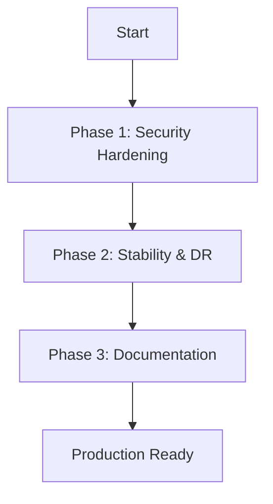

# A.R.C. Platform Spike - Concerns & Action Plan

**Created:** December 13, 2025
**Status:** Ready for Implementation
**Total Issues:** 5 | **Critical:** 0 | **High:** 2 | **Medium:** 3

## CONCERNS INVENTORY

### 🔴 CRITICAL CONCERNS (Blocking Production)

_None. Previous critical issues (Traefik insecurity, Pulsar data wipe) have been resolved._

### 🟡 HIGH-PRIORITY CONCERNS

#### H1. Default Basic-Auth Hashes in Production Config

- **Category:** Security
- **Current State:** `deployments/docker/docker-compose.production.yml` defines default values for authentication variables using known hashes (e.g., `admin:admin`).
- **Evidence:**
  ```yaml
  - 'traefik.http.middlewares.prometheus-auth.basicauth.users=${PROMETHEUS_AUTH:-admin:$$apr1$$H6uskkkW$$IgXLP6ewTrSuBkTrqE8wj/}'
  ```
- **Impact:** If an operator deploys without explicitly setting these variables, the services will be accessible with publicly known credentials.
- **Solution Approach:** Remove the default values. Use shell parameter expansion to force failure if the variable is unset: `${PROMETHEUS_AUTH:?Error: PROMETHEUS_AUTH must be set}`.
- **Acceptance Criteria:** `docker compose up` fails if `PROMETHEUS_AUTH` is not provided in the environment.

#### H2. Missing TLS Automation

- **Category:** Security
- **Current State:** `core/gateway/traefik/traefik.yml` defines `web` and `websecure` entrypoints but lacks a Certificate Resolver configuration (ACME/Let's Encrypt).
- **Impact:** Production deployments require manual certificate management or will run over HTTP, which is unacceptable for secure workloads.
- **Solution Approach:** Add ACME configuration to `traefik.yml` (commented out by default or enabled via environment variables) to support Let's Encrypt HTTP-01 or DNS-01 challenges.
- **Acceptance Criteria:** Traefik automatically provisions valid SSL certificates for configured domains.

### 🟢 MEDIUM-PRIORITY CONCERNS

#### M1. Unpinned Container Images

- **Category:** Stability
- **Current State:** Several core services use `latest` tags.
- **Evidence:**
  - `infisical/infisical:latest-postgres`
  - `apachepulsar/pulsar:latest`
- **Impact:** Updates to upstream images could introduce breaking changes or regressions without warning.
- **Solution Approach:** Pin all images to specific semantic versions (e.g., `apachepulsar/pulsar:3.1.1`).
- **Acceptance Criteria:** No `latest` tags present in `docker-compose.core.yml`.

#### M2. Incomplete Backup Strategy

- **Category:** Disaster Recovery
- **Current State:** `Makefile` includes `backup-db` for Postgres, but no mechanism exists to backup Infisical secrets or Pulsar message data.
- **Impact:** Loss of the Infisical volume would result in total loss of all platform secrets, rendering the database backups useless (as data might be encrypted or credentials lost).
- **Solution Approach:** Add `backup-secrets` and `backup-streams` targets to `Makefile`.
- **Acceptance Criteria:** `make backup-all` creates artifacts for SQL, Secrets, and Streams.

#### M3. Documentation Drift

- **Category:** Documentation
- **Current State:** `docs/OPERATIONS.md` instructs users to manually copy `.env.example`, ignoring the new `make generate-secrets` automation.
- **Impact:** Confuses new users and may lead to weak security configurations.
- **Solution Approach:** Update `OPERATIONS.md` to align with the `Makefile` workflow.
- **Acceptance Criteria:** Documentation accurately reflects the current setup process.

## SOLUTION PLAN

### PHASE 1: HIGH-PRIORITY FIXES (Estimated Effort: 4 Hours)

1.  **Secure Auth Defaults (H1)**

    - **File:** `deployments/docker/docker-compose.production.yml`
    - **Action:** Replace defaults with strict variable requirements (`${VAR:?Error...}`).
    - **Verify:** Run `make up` without `.env` and confirm failure.

2.  **Enable TLS (H2)**
    - **File:** `core/gateway/traefik/traefik.yml`
    - **Action:** Add `certificatesResolvers` section.
    - **File:** `deployments/docker/docker-compose.core.yml`
    - **Action:** Map `acme.json` volume.

### PHASE 2: STABILITY & DR (Estimated Effort: 6 Hours)

1.  **Pin Images (M1)**

    - **File:** `deployments/docker/docker-compose.core.yml`
    - **Action:** Update `latest` tags to current stable versions.

2.  **Expand Backups (M2)**
    - **File:** `Makefile`
    - **Action:** Implement `backup-infisical` (dump DB/export) and `backup-pulsar`.

### PHASE 3: DOCUMENTATION (Estimated Effort: 2 Hours)

1.  **Update Ops Guide (M3)**
    - **File:** `docs/OPERATIONS.md`
    - **Action:** Rewrite "Environment Configuration" section.

## IMPLEMENTATION ROADMAP



## SUCCESS CRITERIA

- [ ] Production compose fails without explicit auth variables.
- [ ] Traefik can provision TLS certs.
- [ ] All images are pinned to specific versions.
- [ ] Backup command covers Database, Secrets, and Streams.
- [ ] Operations guide matches actual workflows.
